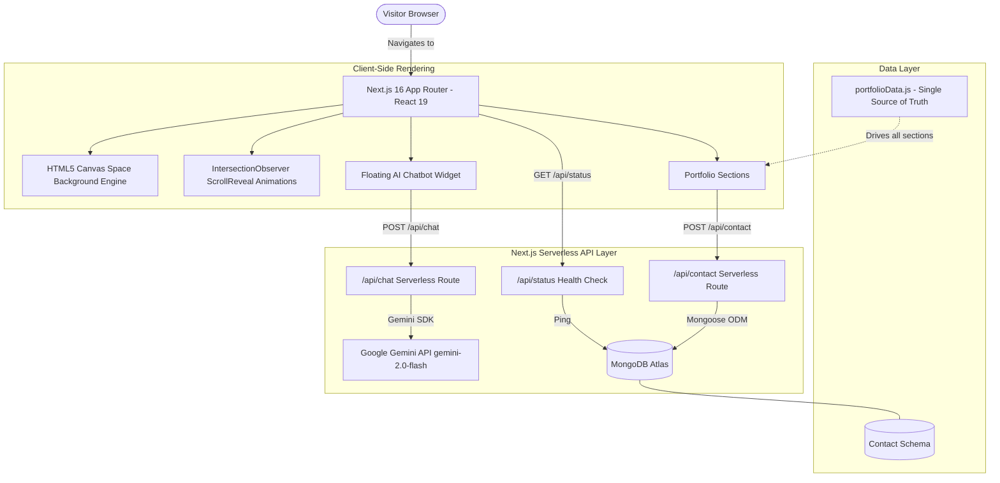

# Prince Jha Portfolio 🚀

An AI-powered full-stack portfolio built with **React.js 19**, **Next.js 16**, **Node.js**, **MongoDB via Mongoose ODM**, **Google Gemini API**, and **Tailwind CSS v4** — featuring sections for About, Skills, Projects, Achievements, and Contact, with a live AI chatbot, HTML5 Canvas animations, scroll-reveal effects, animated counters, VS Code mockup, and a Devicons skills grid.

---

## ✨ Features

- **🤖 Embedded AI Chatbot**: A floating chatbot widget powered by **Google Gemini API** (`gemini-2.0-flash` model) with streaming-style responses, Markdown rendering support (bold, code blocks, inline code, links, lists), persistent chat history, and a configurable system context about Prince Jha for intelligent, portfolio-aware answers.
- **🌌 Immersive Space Background**: A full-viewport HTML5 Canvas animation engine rendering a live starfield (130+ twinkling stars), orbiting planets with shadow rings, a spiraling galaxy cluster, a pulsating black hole with a gravitational lensing glow, and animated nebula-style space clouds — all running at 60fps via `requestAnimationFrame`.
- **🎬 Scroll-Reveal Section Animations**: Custom `ScrollReveal` component using the `IntersectionObserver` API to trigger space-storm-inspired entrance animations — sections materialize with spiraling, converging motion as they enter the viewport and reset on scroll-away for repeatability.
- **📊 Animated Achievement Counters**: Milestone statistics (DSA Problems, GitHub Commits, Repositories, Hackathons) count up from 0 to their target values with a smooth ease-out cubic animation triggered precisely when the Achievements section enters the viewport.
- **📬 Live Contact Form**: A fully functional contact form backed by a **Next.js serverless API route**, **MongoDB** (via **Mongoose ODM**), and cached connection pooling — stores every submitted message persistently in the database with timestamp and metadata.
- **💻 VS Code Code Mockup**: An interactive Python code editor replica in the About section displaying a live representation of Prince's skill stack and profile as a `class`, complete with syntax highlighting, line numbers, dot controls, and a tab bar — styled identically to VS Code dark theme.
- **🏷️ Floating Capability Badges**: Animated orbiting tags (`Full Stack Development`, `DSA`, `Technology`, `Software Engineering`) with per-badge color themes, pulsating glow dots, Lucide vector icons, and independent floating keyframe animations surrounding the profile photo.
- **🔵 Orbital Ring System**: Three concentric dashed orbital rings with sparkle nodes spin at different speeds around the hero profile image — replicating a planetary orbit system aesthetic.
- **🛠️ Skills Grid with Devicons**: A categorized skill matrix rendering official technology logos sourced from the **Devicons CDN** alongside chip labels, organized across Languages, Frontend, Backend, Databases, Tools, CS Fundamentals, and Data Science.
- **🎓 Education Timeline**: A clean vertical timeline card layout showcasing academic milestones with institution names, degree fields, durations, and GPA/percentage scores.
- **📁 Projects Showcase**: Card-based project gallery with full-image thumbnails, feature chip lists, technology stacks, GitHub and live demo links — driven entirely from the central data file.
- **🏆 Achievements Highlight**: Counter stats grid alongside a featured hackathon highlight card (Top 8 IEEE Mega Project Finalist).
- **📡 Backend Status Indicator**: Live backend health check via `/api/status` shown in the navigation bar — green badge when MongoDB and Gemini API are connected, offline fallback status otherwise.
- **📱 Fully Responsive**: Adaptive layout system with CSS Grid and Flexbox breakpoints covering desktop, tablet, and mobile viewports.
- **⚡ Optimized Performance**: GPU-accelerated CSS transforms, `will-change` hints, lazy canvas rendering, and IntersectionObserver-based selective animation triggering — designed to run smooth on all devices without layout jank.

---

## 🛠️ Technology Stack

- **Frontend Framework**: [React.js 19](https://react.dev/) & [Next.js 16 (App Router)](https://nextjs.org/)
- **Backend Runtime**: [Node.js](https://nodejs.org/) with **Next.js Serverless API Routes** (Express-style handler architecture)
- **Programming Language**: [JavaScript (ES2024)](https://developer.mozilla.org/en-US/docs/Web/JavaScript) (JSX + modern ES modules)
- **Styling System**: [Tailwind CSS v4](https://tailwindcss.com/) combined with custom Vanilla CSS design tokens, CSS variables, keyframe animations, and glassmorphism layers
- **AI Integration**: [Google Gemini API](https://ai.google.dev/) via [`@google/generative-ai`](https://www.npmjs.com/package/@google/generative-ai) SDK (`gemini-2.0-flash` model with chat sessions and system context injection)
- **Database**: [MongoDB](https://www.mongodb.com/) (contact form persistence with MongoDB Atlas cloud support)
- **Object Modeling (ODM)**: [Mongoose v9](https://mongoosejs.com/) (schema definitions and cached connection pooling via `global.mongoose`)
- **Icons**: [Lucide React](https://lucide.dev/) (fully tree-shakeable SVG icon library used across all sections)
- **Skill Logos**: [Devicons CDN](https://devicon.dev/) (official technology SVG logos loaded via `jsdelivr` CDN)
- **Canvas Animation Engine**: Native [HTML5 Canvas API](https://developer.mozilla.org/en-US/docs/Web/API/Canvas_API) + `requestAnimationFrame` (custom-built space background — no external animation library)
- **Scroll Animations**: Native [IntersectionObserver API](https://developer.mozilla.org/en-US/docs/Web/API/Intersection_Observer_API) (custom `ScrollReveal` component — zero external dependency)
- **Typography**: [Google Fonts](https://fonts.google.com/) — `Outfit` (headings), `Inter` (body), `Fira Code` (code mockup monospace)
- **Environment Configuration**: [`dotenv`](https://www.npmjs.com/package/dotenv) + Next.js `.env.local` convention
- **Deployment**: [Vercel](https://vercel.com/) (recommended — native Next.js App Router support with serverless functions)

---

## 🗺️ System Architecture



---

## 📁 Project Structure

```
Prince-Jha-Portfolio/
├── app/                              # Next.js App Router
│   ├── layout.jsx                    # Root layout: Google Fonts, metadata & SEO
│   ├── page.jsx                      # Main page (imports and assembles all sections)
│   ├── globals.css                   # Full design system: CSS variables, keyframes, styles
│   ├── icon.png                      # Favicon / PWA icon
│   └── api/                          # Next.js Serverless API Routes
│       ├── chat/route.js             # Google Gemini AI chat handler (POST)
│       ├── contact/route.js          # Contact form → MongoDB persistence (POST)
│       └── status/route.js           # Backend health check (GET)
│
├── components/                       # React Component Library
│   ├── HeroSection.jsx               # Hero: profile, floating badges, orbital rings
│   ├── AboutSection.jsx              # About: bio cards + VS Code Python class mockup
│   ├── EducationSection.jsx          # Education: vertical timeline cards
│   ├── SkillsSection.jsx             # Skills: categorized grid with Devicons CDN logos
│   ├── ProjectsSection.jsx           # Projects: thumbnail cards with tech chips & links
│   ├── AchievementsSection.jsx       # Achievements: animated counters + highlight card
│   ├── ContactSection.jsx            # Contact: live form connected to /api/contact
│   ├── Header.jsx                    # Sticky nav with live active section check & status badge
│   ├── Footer.jsx                    # Footer component
│   ├── ChatbotWidget.jsx             # Floating AI chatbot with Markdown rendering
│   ├── ScrollReveal.jsx              # Reusable IntersectionObserver scroll animator
│   └── SpaceBackground.jsx           # Full-viewport HTML5 Canvas space animation engine
│
├── lib/                              # Utility & Data Libraries
│   ├── portfolioData.js              # ⭐ Single source of truth for all portfolio content
│   ├── db.js                         # Cached Mongoose MongoDB connection pooling
│   └── api.js                        # Client-side API helper functions
│
├── models/                           # Mongoose Database Models
│   └── Contact.js                    # Contact form submission schema
│
├── public/assets/                    # Static Assets
│   ├── profile.jpg                   # Hero profile photograph
│   ├── projects/                     # Project thumbnail images
│   └── skills/                       # Custom skill logos (Mongoose, EJS, OS, Networks etc.)
│
├── .env.example                      # Environment variable template
├── .env.local                        # Local secrets (gitignored)
├── jsconfig.json                     # Path alias: @/ → project root
├── next.config.mjs                   # Next.js configuration
├── postcss.config.mjs                # PostCSS + Tailwind v4 pipeline
└── package.json                      # Dependencies & npm scripts
```

---

## 🔌 API Endpoints

| Method | Route | Description |
|--------|-------|-------------|
| `POST` | `/api/chat` | Forwards user message to Google Gemini with portfolio context system prompt. Returns AI text response. |
| `POST` | `/api/contact` | Validates and persists contact form submission (name, email, subject, message) to MongoDB. |
| `GET` | `/api/status` | Health check — reports MongoDB connection status and Gemini API key configuration state. |

---

## 🗄️ Database Schema

### Contact Model (`models/Contact.js`)
Stores every message submitted through the contact form:

- **name** — Sender's full name *(required)*
- **email** — Sender's email address *(required)*
- **subject** — Message's subject line *(required)*
- **message** — Full message body *(required)*
- **createdAt** — Auto-timestamp via Mongoose schema `timestamps` option

---

## 💻 Local Setup & Installation

### Prerequisites
- [Node.js](https://nodejs.org/) v18.x or higher
- A Google Gemini API Key from [Google AI Studio](https://aistudio.google.com/)
- MongoDB — [local instance](https://www.mongodb.com/try/download/community) or free [MongoDB Atlas](https://cloud.mongodb.com/) URI

### 1. Clone the Repository
```bash
git clone https://github.com/pjha91275/Prince-Jha-Portfolio.git
cd Prince-Jha-Portfolio
```

### 2. Install Dependencies
```bash
npm install
```

### 3. Configure Environment Variables
```bash
# Copy the template
cp .env.example .env.local
```
Open `.env.local` and fill in:
```env
# Public base URL for API calls
NEXT_PUBLIC_API_URL=http://localhost:3000

# Google Gemini API Key
GEMINI_API_KEY=your_gemini_api_key_here

# MongoDB Connection URI
MONGODB_URI=mongodb://localhost:27017/prince_jha_portfolio
```

> **Note:** Both keys are optional. The site renders fully without them, with graceful fallbacks — the backend status badge will show as inactive.

### 4. Start the Development Server
```bash
npm run dev
```
Navigate to **[http://localhost:3000](http://localhost:3000)**.

### 5. Build for Production
```bash
npm run build
npm run start
```

---

## ☁️ Deployment (Vercel)

1. Push to a GitHub repository.
2. Import into [Vercel](https://vercel.com/) and add Environment Variables:
   - `NEXT_PUBLIC_API_URL` — Your live domain (e.g. `https://princejha.vercel.app`)
   - `GEMINI_API_KEY` — Your Google Gemini API Key
   - `MONGODB_URI` — Your MongoDB Atlas connection string
3. Deploy — Vercel auto-detects Next.js and wires up serverless API routes.

> Do **not** commit `.env.local` to Git — it is already in `.gitignore`.

---

## ✏️ Customization

All portfolio content is centralized in one file:

**[`lib/portfolioData.js`](lib/portfolioData.js)**

Update personal info, bio, education, skills, projects, and achievements here — no component files need to be touched.

---

## 👤 Author

**Prince Jha**
- 🌐 Portfolio: [princejha.vercel.app](https://princejha.vercel.app)
- 💼 GitHub: [@pjha91275](https://github.com/pjha91275)
- 🔗 LinkedIn: [prince-jha-dev](https://linkedin.com/in/prince-jha-dev)
- 📧 Email: pjha91275@gmail.com

---

## ⚖️ License

This project is open-source and available under the [MIT License](LICENSE).
